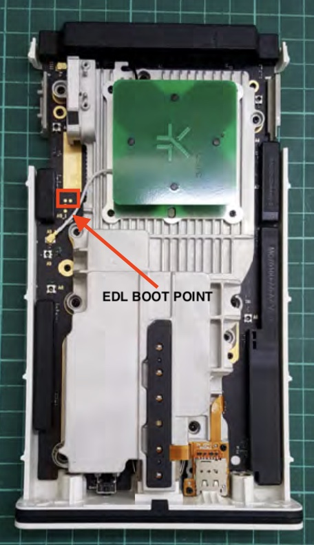
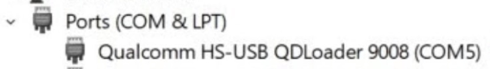

# Enter 'Emergency Download Mode' (EDL) if your unit is bricked

In case of soft bricked unit (usually ZTE device with VID/PID *19d2:0076*), there is another way to enter the CPE into ***EDL Mode***.

Remove the two screws on the bottom of the CPE, slide down the internal part (using a spudger or a flat screw driver to leverage).
When you got out the internal  part, in the below image, you can see the points for **EDL BOOT POINT** (red square). 

On some units, they may be slightly covered by the radiator:



##
Use a paperclip or tweezer to short these two points, keep them shorted and attach USB-C cable to the CPE.
You should see into *Device Manager* (Windows) or `lsusb` (Linux) a device in ***EDL Mode***:
- For Windows users, you will have this COM port:




- For Linux users you will have this output:
```
  Bus 004 Device 032: ID 05c6:9008 Qualcomm, Inc. Gobi Wireless Modem (QDL mode)
```
  
Remove remove the paperclip/tweezer and use **QFIL** or **edl** to flash firmware back into CPE.
